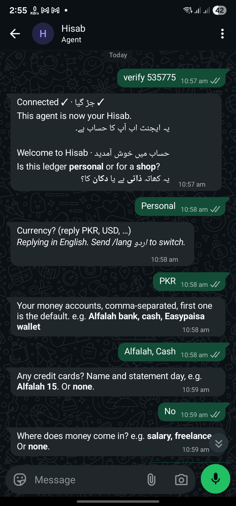
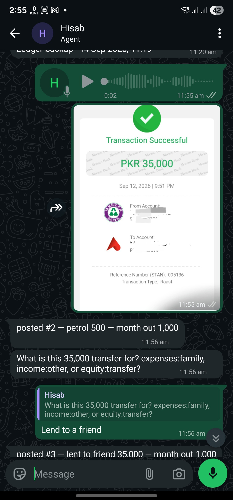

# Hisab on WhatsApp


A ledger you text. Send **"2500 coffee"**, a voice note in Urdu, Roman Urdu or English, or a photo of a receipt to your own WhatsApp agent, and it posts a real double-entry transaction to a plain-text ledger you own. One line comes back: the entry number and where the month stands.

*Hisab* (حساب) is the word every Urdu speaker already uses for exactly this.

<p align="center">
  
  &nbsp;&nbsp;
  
</p>
<p align="center"><sub>Left: connecting a real agent, then setup, in English and Urdu. Right: a voice note posts #2; a forwarded bank receipt gets one question, answered by quoting it, and posts #3.</sub></p>

> Built for the [AI Tinkerers global hackathon *Agents, Everywhere*](https://islamabad-rawalpindi.aitinkerers.org/p/agents-everywhere-beyond-the-chatbot-global-hackathon) (2026-09-12). Landing page: [mhmzdev.github.io/hisab](https://mhmzdev.github.io/hisab/). Extracted from a personal system the author has run since early September 2026; this is the public, API-level rewrite. No WhatsApp agent at hand? The terminal path below verifies the same pipeline.

## Run it in your terminal, right now

No phone, no WhatsApp, one key. The same pipeline, against a committed sample ledger (a kiryana store, two weeks, fake numbers).

Paste this into Claude Code, Codex, Cursor or any coding agent that can run commands:

```text
Set up and run the Hisab terminal demo from https://github.com/mhmzdev/hisab-whatsapp. No phone or WhatsApp is needed.

1. Clone the repo into the current folder, unless we are already inside it, and read README.md and AGENTS.md.
2. Check for python3 (3.9 or newer) and hledger. If hledger is missing, tell me the install command for my OS (brew install hledger, or sudo apt install hledger) and ask before running it.
3. Create a virtual environment in .venv, activate it, and install requirements.txt into it. Use that environment for every python3 command below.
4. Copy .env.example to .env and config.example.yaml to config.yaml. Do not ask me to paste an API key into this chat. Tell me to open .env myself and fill in either OPENROUTER_API_KEY or GEMINI_API_KEY (one is enough; the config picks whichever is set), then wait until I say it is done.
5. Run python3 tests/check_endpoint.py. If a step fails because of the key, tell me which key line to fix. Fix anything else yourself.
6. Run the demo with its five sample messages piped in:
   printf 'Metro ko kitna dena hai\nis mahine vs pichla\naaj ki sale 45000\nwhat can I afford\nundo\n' | bash tests/demo_terminal.sh
7. Show me the replies, one line each on what happened: a supplier balance, this month against last, a posted entry with its number, what I can afford, and that entry undone.

Stay inside this repo. Never print, commit or send the contents of .env. Do not edit sample-vault/; the demo works on a copy.
```

Every reply in that demo is the model calling one of six tools against `hledger`; nothing is scripted. Afterwards, `bash tests/demo_terminal.sh` lets you type your own messages.

<details>
<summary>Or run the steps yourself</summary>

```bash
git clone https://github.com/mhmzdev/hisab-whatsapp && cd hisab-whatsapp
python3 -m venv .venv && source .venv/bin/activate
pip install -r requirements.txt            # needs hledger on PATH (brew install hledger / apt install hledger)
cp .env.example .env                       # fill in OPENROUTER_API_KEY or GEMINI_API_KEY; one is enough
cp config.example.yaml config.yaml         # provider auto: OpenRouter if that key is set, else Gemini
python3 tests/check_endpoint.py            # key valid, model has tools, transcription answers
bash tests/demo_terminal.sh
```

Then type, one per line:

```
Metro ko kitna dena hai
is mahine vs pichla
aaj ki sale 45000
what can I afford
undo
```

You will see the supplier balance, a two-column month table, a posted entry with its number, an affordability block, and the entry reversed.

</details>

## Why this is not a chatbot on WhatsApp

- **Undo is a reply.** Quote the old message, say *undo*, and that entry reverses. A native WhatsApp gesture is the agent's control surface.
- **Every ledger line sits beside the message that made it.** Entries carry a number; the store maps it to the WhatsApp message id and keeps the posted block. The chat is the audit trail.
- **Private by platform.** A WhatsApp agent talks only to the person who created it. Self-hosted, there is no server of ours, no account, nothing to breach.

## What's under it

- **hledger**, a real plain-text accounting engine, not a categoriser. The ledger is a markdown file you can open anywhere. Every append runs `hledger check --strict`; a bad entry rolls back. Transfers are transfers, not spend, so the month total is honest.
- **A small tool-calling loop** on any OpenAI-compatible endpoint (OpenRouter by default, one key for the model and voice transcription). **Six tools, nothing else:** append, undo, report, learn a category rule, read accounts, add account. No shell, no file access.
- **The WhatsApp Agent Platform** ([WhatsApp's introduction to third-party agents](https://faq.whatsapp.com/1050934623978152), where platform changes are announced and the rest of its documentation is linked): long-poll, one creator, thirty days of buffered messages. Idempotent by message id; the offset advances only after a batch, so a crash replays rather than drops or doubles. Model calls retry with backoff. This transport was extracted into its own package, [**`wa-agent`**](https://pypi.org/project/wa-agent/) ([whatsapp-agent-cli](https://github.com/mhmzdev/whatsapp-agent-cli)) — Hisab is its first product and runs on it ([#57](https://github.com/mhmzdev/hisab-whatsapp/issues/57)); `hisab/wa.py` is the thin adapter.
- **Setup is a conversation, in your language.** The first message asks, in English and Urdu, whether the ledger is personal or for a shop. Whichever you answer in becomes your language for up to eight questions and every fixed reply after; a one-line note says `/lang` switches it. Hisab is written in English and اردو; write to it in Roman Urdu and it answers in Roman Urdu.
- **Forwarded bank SMS are entries.** Long-press the bank's message, share it to the agent, done.
- **`export-ledger` returns your books.** Send it to the agent and the ledger folder comes back as a ZIP document named by local date and time (`hisab-2026-09-14-1110.zip`, `timezone` in config): no keys, no chat history.
- **Failures say what to do next.** A model outage, an unreadable voice note or a rejected entry gets one fixed line in your language, never a stack trace or a provider's error.

Architecture in one page: [`ARCHITECTURE.md`](ARCHITECTURE.md).

## What you can send

| Send | What happens |
|---|---|
| `2500 coffee` · `Metro ko 20000 diye` · a voice note · a receipt photo · a forwarded bank SMS | one posted entry, or one question if the amount or account is unclear |
| `balances` · `is mahine vs pichla` · `what can I afford` | a report in a code block |
| `undo`, or *undo* quoting an old message | the last entry, or that message's entry, reversed |
| `export-ledger` | the ledger folder as a ZIP |
| `/lang اردو` · `/lang english` | switch the language of every fixed reply |
| `/help` · `/clear` (forget the chat context) · `/setup` (run setup again) | fixed replies, no model call |

## Run it for real

You need a phone with WhatsApp, Docker, and an [OpenRouter](https://openrouter.ai) or [Gemini](https://aistudio.google.com/apikey) key.

1. In WhatsApp: Settings → Agents → Create an agent → Chat info → copy the API key. WhatsApp's own guide: [Introduction to Third-Party Agents on WhatsApp](https://faq.whatsapp.com/1050934623978152).
2. `cp .env.example .env` and paste the WhatsApp key and your model key (OpenRouter or Gemini; one is enough).
3. `cp config.example.yaml config.yaml`. The defaults are fine; change the model if you like.
4. `docker compose up -d` (or `make selfhost`)
5. Send your agent any message. It asks personal or shop (in English and Urdu, answer in either), then up to seven more questions in that language, writes your chart of accounts, and posts what you sent.

Your ledger lives in `./vault/` on your machine. Nothing goes to anyone but your model provider.

**Setting it up for someone else** (a shop): they create the agent on *their* phone and send you the key; you run the container. They text, they get replies. You only ever see the ledger file, and only if they show you.

## Hosted Hisab (built, not deployed)

For people who will never run Docker: sign in with a phone number, paste your agent's key, send the code the portal shows you to your agent, and we run the worker. Your key and ledger then live on our server, encrypted. Send `export-ledger` to your agent and the ledger comes back as a ZIP; revoke stops the worker and deletes the key. Self-host (above, `make selfhost`) keeps both on your own machine. 300 PKR/month is the presentation price; nothing in this repo collects it.

All of it works end to end on one machine; none of it is on the internet yet. The landing page and portal in `landing/` (phone sign-in, the key sealed in the browser, the `verify <code>` step, a Connected screen with live activity and a working Revoke), the runner in `runner/` that turns a Firestore tenant into one isolated worker, matches the code, enforces the monthly model-call allowance (refunded when the model side fails) and retains a revoked ledger for 30 days. `make up` runs the whole stack — the Auth/Firestore/Hosting emulators, the runner on Gemini, and the portal at http://localhost:3031/portal/ — as one command (see [`runner/README.md`](runner/README.md)); `make dev` runs the runner on OpenRouter against a dedicated dev Firebase project once one exists. The left screenshot above is this flow on a real agent. Design: [`docs/brainstorm/hosted-portal.md`](docs/brainstorm/hosted-portal.md); spec: [`docs/specs/001-hosted-portal.md`](docs/specs/001-hosted-portal.md).

## Viewing

The ledger is a markdown file. Open the folder in Obsidian with [hledger-dashboard](https://github.com/cousine/hledger-dashboard) for a balance sheet, monthly trends, a register, transfers and budget-versus-actual, all read from the same file. [Hledger Notes](https://github.com/bzimor/obsidian_hledger) is a desk-side entry modal for batch backfill. Neither is part of this project. `hledger` on the command line reads the folder as-is.

## What else this pattern does

The same shape, one creator, long-poll, a fenced tool surface, is a different product with different tools. None of these is built here.

- **A coding agent in your pocket.** Read-only over a repo by default; *what did I leave broken in auth yesterday* from the bus. This is where Hisab came from.
- **Personal ops.** A morning message with today's three things; an evening voice note captured to a file.
- **Small-business back office.** Stock counts, supplier orders, staff attendance, the same six-tool discipline.
- **Field capture.** Site visits, deliveries, inspections: a photo plus a sentence, where the moment happens.

## Privacy

Entries, voice notes and receipt photos go to the model provider you configured, through OpenRouter or the endpoint you set. Nothing goes to the author. To keep one provider, set `model.provider_pin`. The ledger, the message store and your keys never leave the machine you run this on.

## Working on it

`python3 tests/smoke.py` is the check: no network, no keys. `make help` lists every target. Coding agents (and people) start at [`AGENTS.md`](AGENTS.md), then [`ARCHITECTURE.md`](ARCHITECTURE.md), then [`docs/INDEX.md`](docs/INDEX.md), which routes to every spec, plan and acceptance checklist behind the code. Work moves brainstorm → spec → GitHub issue → plan → review → PR, and those artifacts are committed beside the code.

## Origin and related

Extracted from a personal system running since September 2026: a bash relay on a VPS between a WhatsApp agent and Claude Code over a private vault, plus a ledger skill. This repo is the public rewrite as a plain API loop so it runs with any model. The WhatsApp transport this grew into now lives in [**whatsapp-agent-cli**](https://github.com/mhmzdev/whatsapp-agent-cli), published as [`wa-agent`](https://pypi.org/project/wa-agent/): send, receive, media and transcription as a library and a command, with Hisab as its first product. The Claude Code relay this began as is that repository's next release, `wa-agent relay` — it was going to be a repo called `whatsapp-agent-relay`, announced here after [the event](https://islamabad-rawalpindi.aitinkerers.org/p/agents-everywhere-beyond-the-chatbot-global-hackathon), and became a command in the CLI instead.

## License

MIT.
